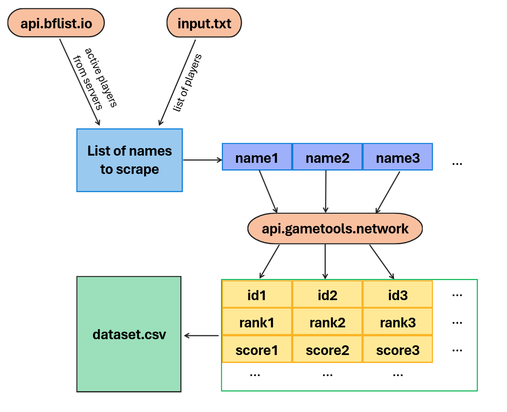

# 01. Data Collection
This stage focuses on collecting structured player statistics for Battlefield 4.
The goal is to build a large-scale dataset that combines **regular player** statistics and **verified cheater** statistics.
The parser code is available in a [separate repository](https://github.com/chastertlye/battlefield-stats-scraper)

## ⚙️ Data Source

Data is collected from three resources:
- `api.bflist.io` - to obtain lists of active servers (get players from populated servers)
- `api.gametools.network` - to fetch per-player statistics and aggregated stats endpoints
- `bf4db.com` - community-maintained anti-cheat database; used to label known cheaters

## 🧱 Dataset Structure
Dataset uses the following columns:
```text
'userName', 'id', 'rank', 'scorePerMinute', 'killsPerMinute',
'winPercent', 'killDeath', 'quits', 'accuracy', 'headshots',
'secondsPlayed', 'kills', 'deaths', 'wins', 'loses', 'avengerKills',
'saviorKills', 'headShots', 'heals', 'revives', 'repairs', 'resupplies',
'killAssists', 'skill', 'longestHeadShot', 'highestKillStreak'
```
**Note:** The `'headshots'` and `'headShots'` columns represent different metrics - `'headshots'` is the percentage of total kills that were headshots, while `'headShots'` is the absolute number of headshot kills.



## 📦 Collected Datasets
Two separate datasets were collected during the data acquisition stage:
1. `players.csv` - contains stats of players, scraped from servers in **August, 2025**. The following command was used:
```bash
python run.py -g bf4 -inf -o players.csv -b 100 -d 120
```
2. `cheaters.csv` - Contains statistics of players banned on **bf4db.com** for using third-party software. The following command was used:
```bash
python run.py -g bf4 -i cheater_names.txt -o players.csv -b 100
```
3. Anonymized Samples
Due to the large size of the dataset and privacy concerns, only a small sample is available in the repository.
- `data/anon_players.csv` - anonymized sample of `players.csv` (250 rows)
- `data/anon_cheaters.csv` - anonymized sample of `cheaters.csv` (50 rows)

Collected datasets will be used in Stage 2 — Exploratory Data Analysis (EDA) to compare behavioral patterns between regular players and cheaters.