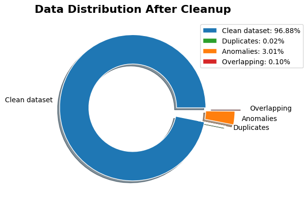

# 02. Data Cleaning

This stages focuses on cleaning and preprocessing the Battlefield 4 players dataset. The content is based on the notebook in the repository (see `02_cleaning.ipynb`) and includes key actions: data loading, duplicate removal, exclusion of overlaps with the cheaters database, labeling, anomaly detection using predefined bounds, and saving the cleaned dataset.

## 🎯 Key goal

Prepare a consistent and analysis-ready dataset by removing obvious errors and anomalies while preserving relevant observations.

### Input files

- `data/players.csv` — collected player statistics (or `data/anon_players.csv` for demo).
- `data/cheaters.csv` — list of players marked as cheaters (or `data/anon_cheaters.csv` for demo).

### Output files

- `data/clean_players.csv` — the combined and cleaned dataset ready for further analysis.

## 🧹 Cleaning steps 

1. **Remove duplicates:** 
For each file, rows with duplicate `id` values are counted and removed using `drop_duplicates(subset='id')`.

2. **Exclude overlaps:** Check for overlapping IDs: players from `players.csv` who also appear in `cheaters.csv` are removed from the players list. This ensures that the "non-cheater" group does not contain flagged players.

3. **Labeling and concatenation:** Add a column `cheater = 1` to the cheaters file and `cheater = 0` to the players file. Concatenate both tables into a single DataFrame `df`.

4. **Anomaly detection using predefined bounds:**
   - For all columns a `limits = { 'col': (min, max), ... }` dictionary is defined.
   - Rows where any of these column values fall outside the bounds are logged into a separate DataFrame `df_anomalies` and excluded from the main `df`.
   - The notebook includes example reasonable limits (e.g., `rank` 0–140, `accuracy` 0–100%).

5. Save
   - The cleaned DataFrame is saved as `data/clean_players.csv`.

6. Visualize cleaning results
   - A pie chart is created showing the distribution across categories: clean dataset, removed duplicates, anomalies, and overlaps (overlapping IDs).

