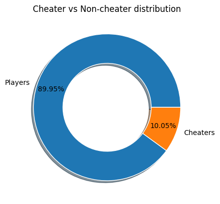
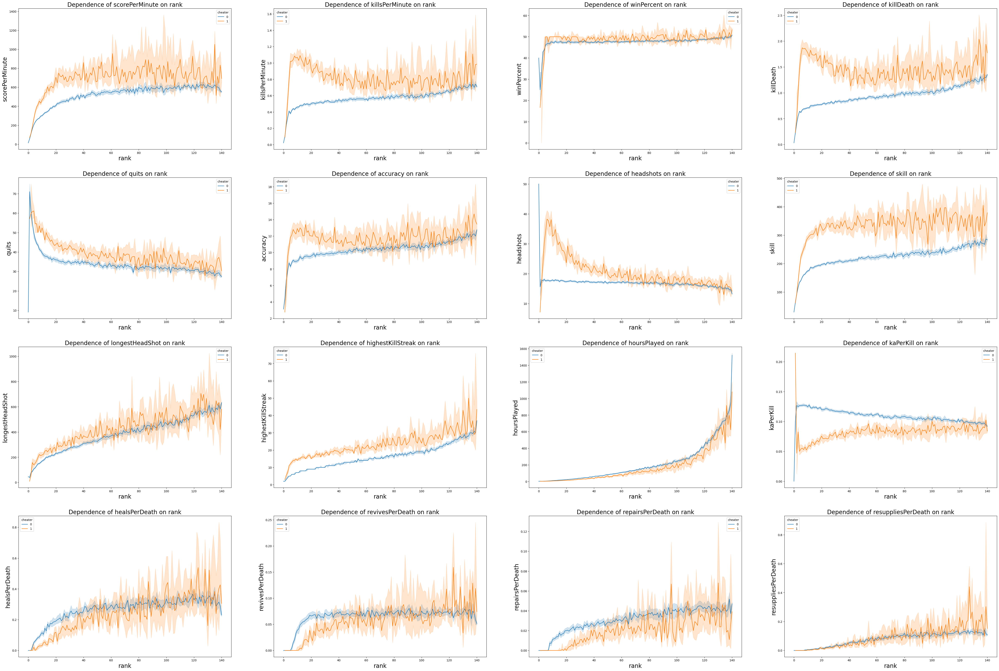

# 03. EDA & Feature Engineering
This stage focuses on exploratory data analysis and the creation of new engineered features for the Battlefield 4 players dataset.
The content is based on the notebook in the repository (see `03_eda_feature_engineering.ipynb`) and includes feature generation, removal of uninformative columns, visualization of key metrics, and preparation of the dataset for modeling.

## 🎯 Key goal
Explore and transform the cleaned player dataset to identify which gameplay metrics differ between cheaters and non-cheaters, and prepare a feature set suitable for further statistical and machine learning analysis.
**Input files**
- `data/clean.csv` — the cleaned dataset produced during the previous stage.
**Output files**
- `data/ready.csv` — dataset ready for modeling and feature importance analysis.

## 🔍 Analysis and feature creation steps

1. **Initial inspection**
   - Load the cleaned dataset and compute descriptive statistics (`df.describe()`).

2. **Feature engineering**
   - Derived new ratio-based columns to normalize player activity:
     - `hoursPlayed` — converted from `secondsPlayed`.
     - `kaPerKill` — kill assists per kill.
     - `healsPerDeath`, `revivesPerDeath`, `repairsPerDeath`, `resuppliesPerDeath` — per-death efficiency ratios.
   - Safe division operations ensure no division-by-zero errors.

3. **Column cleanup**
   - Dropped redundant or less-informative columns (IDs, totals replaced by ratios, raw assist counters).
   - Removed players with extremely low playtime (`hoursPlayed ≤ 1`).

4. **Exploratory visualization**
   - Check the `cheater` label distribution using a pie chart.

   - Compared median values of each feature across player `rank`, grouped by `cheater` status.
   - Identified trends: cheaters often have higher skill, kill/death ratio, and kills per minute.
   - Features like `longestHeadshot`, `hoursPlayed`, and per-death heal/revive rates showed minimal difference and were later dropped.

   

5. **Final feature selection**
   - Retained only informative variables showing measurable distinction between cheaters and non-cheaters.
   - Saved the resulting DataFrame as `media/ready.csv`.

## 📊 Key findings

- **Behavioral differences:** cheaters consistently show elevated `killDeath`, `skill`, and `killsPerMinute` metrics, suggesting artificially boosted efficiency.
- **Neutral indicators:** metrics like healing or support actions per life show almost identical patterns across both groups.
- **Data integrity:** filtering low-hour players significantly reduced noise and improved rank-based stability of metrics.